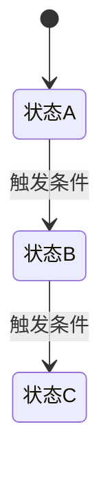
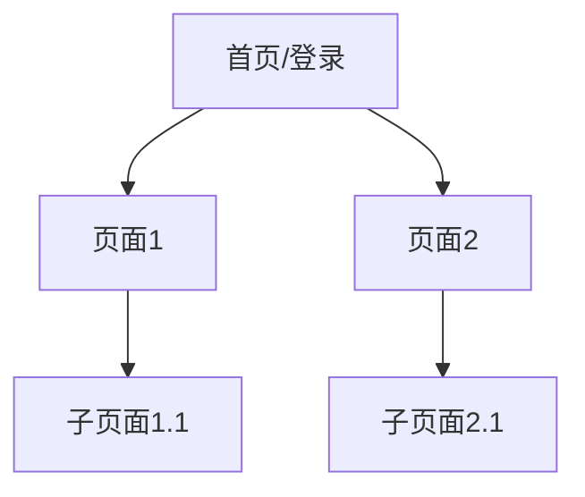

# 需求说明书 - {系统名称}

> 版本：v1.0 | 创建日期：{date} | 作者：Steven-Zhl

---

## 1. 需求概述

**背景**：{一句话说明为什么要做这个系统}

**目标**：{这个系统要解决什么问题}

**用户角色**：

| 角色 | 说明 | 数据权限范围 |
|------|------|------------|
| {角色名} | {说明} | {全量 / 仅自己的数据 / ...} |

---

## 2. 功能清单

{按角色或模块分组，简要列出核心功能}

- **{模块名}**：{功能1}、{功能2}、{功能3}
- **{模块名}**：...

---

## 3. 业务流程（如有状态流转）

{用文字描述关键流程，或Mermaid流程图}



**状态说明**：

| 状态值 | 含义 | 可执行操作 | 下一状态 |
|--------|------|-----------|---------|
| {status} | {含义} | {操作} | {next} |

---

## 4. Collection 设计

### 4.1 实体关系总览

{用文字说明各Collection之间的关系}

```mermaid
erDiagram
    {COLLECTION_A} ||--o{ {COLLECTION_B} : "引用"
    {COLLECTION_A} {
        ObjectId _id
        string field1
    }
```

### 4.2 Collection 详细设计

#### {collection_name}

**用途**：{这个Collection存什么}

**嵌入 vs 引用决策**：{说明关键的设计决策理由}

| 字段名 | 类型 | 必填 | 默认值 | 说明 |
|--------|------|------|--------|------|
| _id | ObjectId | 自动 | - | MongoDB主键 |
| {field} | {type} | 是/否 | {default} | {说明} |
| created_at | datetime | 自动 | utcnow() | 创建时间 |
| updated_at | datetime | 自动 | utcnow() | 最后更新时间 |
| is_deleted | bool | 自动 | False | 软删除标记 |

**索引设计**：

| 索引字段 | 类型 | 说明 |
|---------|------|------|
| {field} | 单字段 / 复合 / 唯一 | {覆盖哪个查询场景} |

**封装方法**：

```python
# 对应的DB操作方法
find_{collection}({"_id": id})
list_{collection}({"status": "active"}, page=1, page_size=20)
add_{collection}({...})
update_{collection}({"_id": id}, {"$set": {...}})
delete_{collection}({"_id": id})  # 软删除则改为 update is_deleted=True
```

---

## 5. API 设计

**Base URL**：`/api/v1`

**通用响应格式**：

```json
{
  "code": 0,
  "message": "success",
  "data": {}
}
```

**分页响应格式**（list接口）：

```json
{
  "code": 0,
  "message": "success",
  "data": {
    "total": 100,
    "page": 1,
    "page_size": 20,
    "items": []
  }
}
```

### {模块名}

#### {接口名称}

| 项目 | 内容 |
|------|------|
| 路径 | `GET /resource/{id}` |
| 描述 | {一句话说明} |
| 权限 | {哪些角色可访问} |

**请求参数**：

| 参数名 | 位置 | 类型 | 必填 | 说明 |
|--------|------|------|------|------|
| {param} | path/query/body | string/int/bool | 是/否 | {说明} |

**请求体示例**（POST/PUT）：

```json
{
  "field1": "value",
  "field2": 123
}
```

**响应示例**：

```json
{
  "code": 0,
  "message": "success",
  "data": {
    "_id": "64f1a2b3c4d5e6f7a8b9c0d1",
    "field1": "value"
  }
}
```

**对应DB操作**：

```python
result = await find_{collection}({"_id": ObjectId(id)})
```

**异常情况**：

| 场景 | HTTP状态码 | code | message |
|------|-----------|------|---------|
| 资源不存在 | 404 | 404 | "xxx不存在" |
| 无权限 | 403 | 403 | "无操作权限" |

---

## 6. 前端界面设计

> **技术栈**：Vue 3 + Pinia + axios + Element Plus
> **响应式断点**：`<768px`（移动端）、`≥768px`（平板）、`≥1200px`（桌面）

### 6.1 页面结构总览

{用文字说明主要页面和路由结构}



**路由设计**：

| 路径 | 页面名称 | 布局类型 | 权限 |
|------|---------|---------|------|
| `/` | 首页/登录页 | 全屏 | 公开 |
| `/xxx` | {页面名} | {主布局/全屏/嵌套} | {角色} |

---

### 6.2 核心页面线框图

#### {页面名称}

**用途**：{一句话说明}

**布局类型**：{主布局 / 全屏页 / 弹窗页 / 嵌套页}

**响应式策略**：{移动端如何适配，例如：侧边栏收起、表格变卡片、堆叠布局}

```
┌─────────────────────────────────────────────────────────────┐
│  Logo  导航1  导航2  导航3           用户头像 ▼             │  ← 顶部导航栏 (el-header)
├──────────┬──────────────────────────────────────────────────┤
│          │  页面标题                                          │
│   侧边   │  ┌────────┐ 操作区                    [+ 新建]   │  ← 面包屑 + 操作区
│   菜单   │  │ 筛选器 │ [搜索] [重置]                        │
│          │  └────────┘                                     │
│  📁模块1  │  ┌────────────────────────────────────────────┐  │
│  📁模块2  │  │ 表格/列表内容区域                           │  │
│  📁模块3  │  │                                             │  │  ← 主内容区
│          │  │                                             │  │
│          │  └────────────────────────────────────────────┘  │
│          │  <  1  2  3  ...  10  >                        │  ← 分页器
└──────────┴──────────────────────────────────────────────────┘
```

**组件分解**：

| 区域 | Element Plus 组件 | 说明 |
|------|-------------------|------|
| 顶部导航 | `el-menu` (horizontal mode) | 一级导航 |
| 侧边栏 | `el-menu` (vertical mode) | 二级导航 |
| 筛选区 | `el-form` + `el-input/el-select` | 查询条件表单 |
| 操作区 | `el-button` | 新建/批量操作等 |
| 内容区 | `el-table` / `el-card` 列表 | 数据展示 |
| 分页 | `el-pagination` | 翻页 |

**交互说明**：

| 操作 | 触发方式 | 交互反馈 |
|------|---------|---------|
| {操作名} | 点击按钮 | 打开弹窗 / 跳转页面 / 直接执行 |
| {操作名} | 点击表格行 | 高亮选中 + 显示详情抽屉 |
| {操作名} | 悬停 | 显示 tooltip |

**响应式适配**：

```
移动端 (<768px):
┌─────────────────────┐
│ ☰  标题           ≡ │  ← 汉堡菜单 + 更多操作
├─────────────────────┤
│ 筛选区 (可折叠)      │
├─────────────────────┤
│ ┌─────────────────┐ │
│ │ 卡片1          │ │  ← 表格转为卡片列表
│ └─────────────────┘ │
│ ┌─────────────────┐ │
│ │ 卡片2          │ │
│ └─────────────────┘ │
│    底部加载更多      │  ← 分页改为"加载更多"
└─────────────────────┘
```

---

### 6.3 共享组件设计

#### {组件名称}

**用途**：{这个组件在哪些页面复用}

**Props 设计**：

```typescript
interface Props {
  // 属性定义
  id: string          // 资源ID
  mode: 'view' | 'edit'  // 查看或编辑模式
  readonly?: boolean  // 是否只读
}
```

**Emits 设计**：

```typescript
const emit = defineEmits<{
  'update': [value: any]
  'delete': [id: string]
  'cancel': []
}>()
```

**线框示意**：
```
┌─────────────────────────────────┐
│  组件标题                        │
├─────────────────────────────────┤
│  ┌───────┐  ┌───────┐           │
│  │ 字段1 │  │ 字段2 │           │
│  └───────┘  └───────┘           │
│  ┌─────────────────────────┐    │
│  │        字段3（文本域）    │    │
│  └─────────────────────────┘    │
├─────────────────────────────────┤
│        [取消]  [确定]           │
└─────────────────────────────────┘
```

---

### 6.4 状态管理（Pinia）

#### {Store名称}

**用途**：{管理哪些状态}

```typescript
interface State {
  items: Item[]           // 列表数据
  currentItem: Item | null  // 当前选中项
  loading: boolean        // 加载状态
  pagination: {
    page: number
    pageSize: number
    total: number
  }
}

// Actions
- fetchItems(query, page, pageSize)  // 调用 API 获取列表
- fetchItemById(id)                  // 获取详情
- createItem(payload)                // 创建
- updateItem(id, payload)            // 更新
- deleteItem(id)                     // 删除
```

---

### 6.5 API 调用封装（axios）

**API 模块**：`src/api/{module}.ts`

```typescript
import request from '@/utils/request'

export const apiList = (params: ListQuery) => {
  return request.get('/api/v1/resource', { params })
}

export const apiDetail = (id: string) => {
  return request.get(`/api/v1/resource/${id}`)
}

export const apiCreate = (data: CreatePayload) => {
  return request.post('/api/v1/resource', data)
}

export const apiUpdate = (id: string, data: UpdatePayload) => {
  return request.put(`/api/v1/resource/${id}`, data)
}

export const apiDelete = (id: string) => {
  return request.delete(`/api/v1/resource/${id}`)
}
```

---

## 7. 技术注意事项

### 软删除规范

{是否启用软删除，list接口默认过滤 is_deleted=True}

### 权限控制

{描述权限判断方式：基于角色字段 / JWT中的role / 数据owner判断}

### 关键业务规则

- {哪些字段一旦创建不可修改}
- {哪些操作需要记录日志}
- {哪些字段有唯一性约束，通过unique index保证}

### 性能注意点

- {数据量预估}
- {需要特别注意的查询场景}
- {是否需要聚合查询，$lookup使用是否合理}

---

## 7. 开放问题

{还未确认的事项，影响开发时再补充}

| # | 问题 | 影响范围 | 状态 |
|---|------|---------|------|
| 1 | {问题描述} | {影响哪个模块} | 待确认 |
